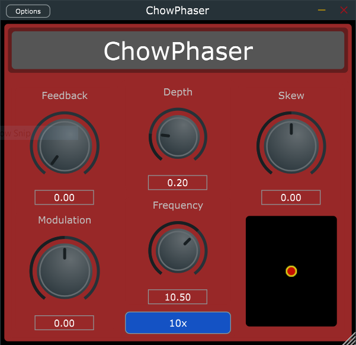

# CHOW Phaser

[](https://travis-ci.com/jatinchowdhury18/ChowPhaser)

CHOW Phaser is an open-source phaser effect,
based *very* loosely on the classic Shulte Compact
Phasing "A".



## Installation

To install, simply download the
[latest release](https://github.com/jatinchowdhury18/ChowPhaser/releases).
If you would like to try the most recent updates
(potentially unstable), see the
[`Bin/`](./Bin) folder.

## Usage

CHOW Phaser is designed to process mono signals. Any
stereo signal passed into the plugin will first
be summed to mono before applying any processing.

Processing is broken up into two stages: feedback and
modulation. The amount of processing done by each
stage can be controlled separately by the "feedback"
and "modulation" knobs. Both stages share the same 
LFO, which is controlled by the "depth" and 
"frequency" parameters, as well as the "skew" knob.
The "10x" parameter simply multiplies the LFO 
frequency by 10.

## Building

To build from scratch, you must have CMake installed.

```bash

# Clone the repository
$ git clone https://github.com/jatinchowdhury18/CHOWPhaser.git
$ cd CHOWPhaser

# initialize and set up submodules
$ ./setup.sh

# build with CMake
$ ch CHOWPhaser
$ mkdir build && cd build/
$ cmake ..
$ cmake --build . --config Release
```

## License

CHOWPhaser is open source, and is licensed under the BSD 3-clause license.
Enjoy!
